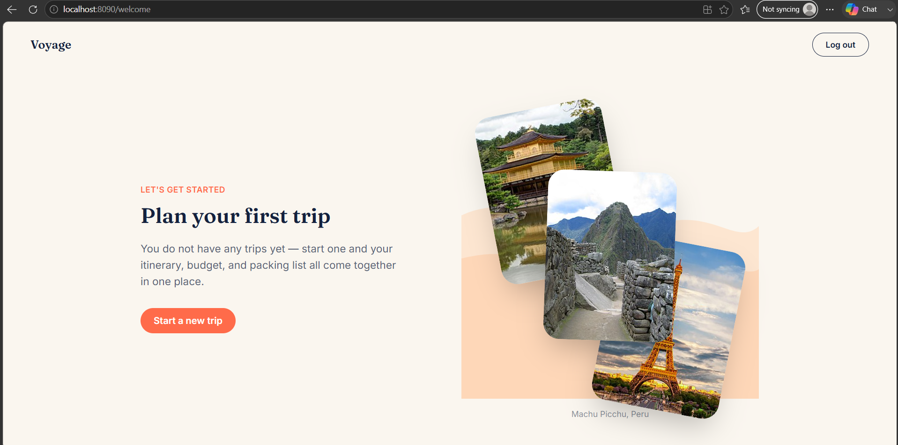
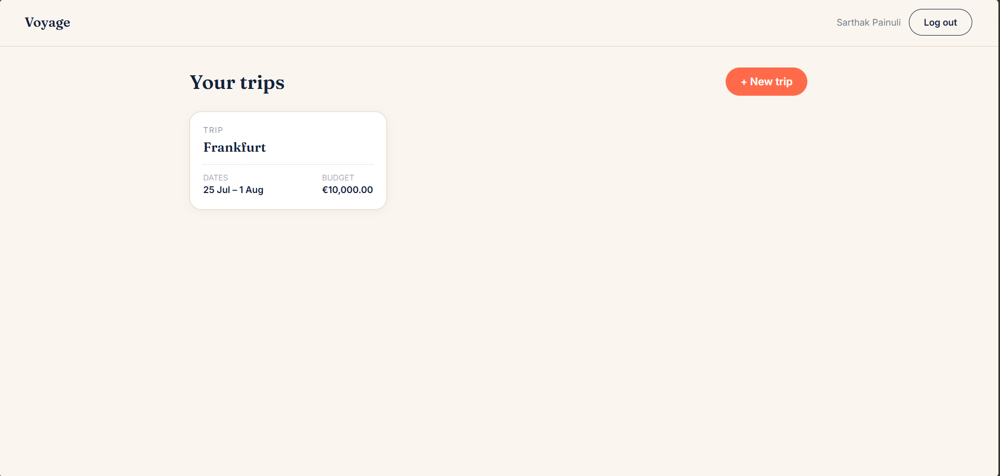
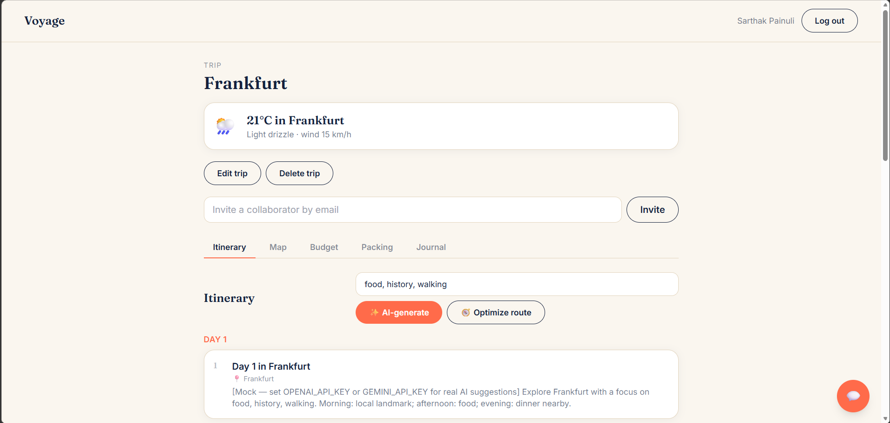
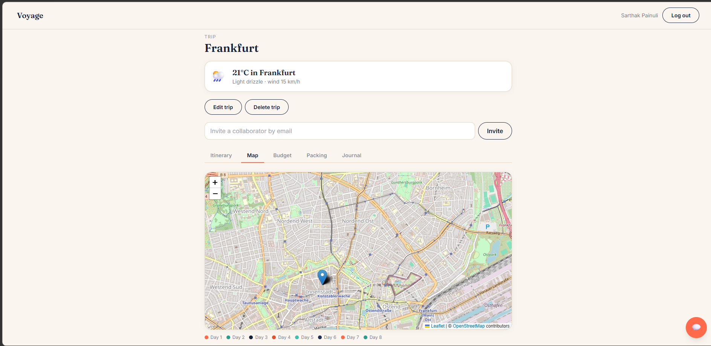
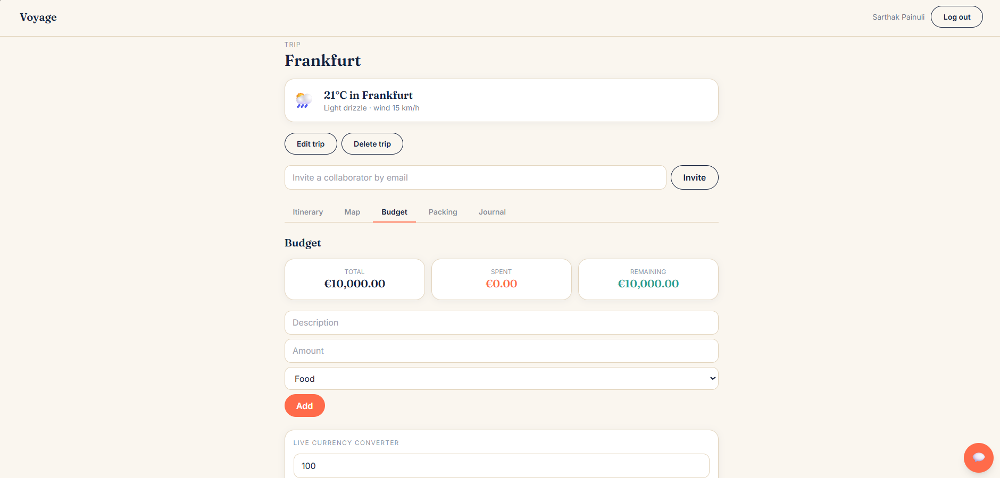
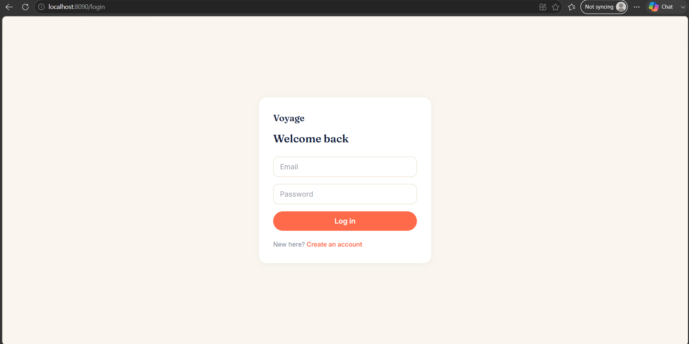
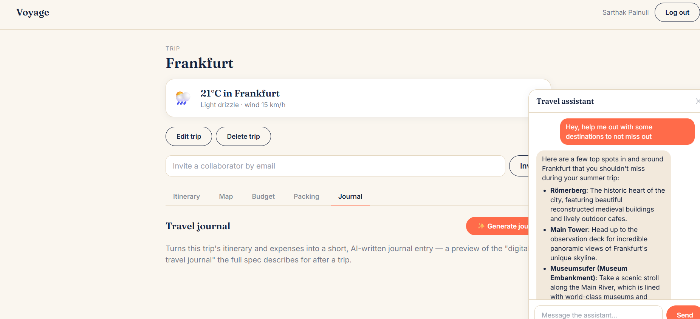

# Voyage — AI-Powered Travel Companion

A full-stack travel companion platform: collaborative trip planning, budgets,
packing checklists, route optimization, a live map, and an AI travel
assistant, built across the three-service architecture from the spec —
Next.js frontend, Java/Spring Boot core backend, and a Python/FastAPI AI
service.

**Read this first — honest scope note:** the original spec describes a
multi-phase product (real Maps/Places, booking integrations, offline mode,
Kubernetes, image recognition, voice assistant, wearables...). That's a
multi-month build, not something any single pass can responsibly claim to
finish. What's in this repo is a **real, working implementation** covering
Phase 1, most of Phase 2/3, and pieces of Phase 4 — see
[What's not built yet](#whats-not-built-yet) for exactly what's still out
of scope.

## Screenshots

_Not included yet — these are placeholders for you to fill in with real
captures of the running app (`docker compose up`, then `http://localhost:8090`).
Save images into `docs/screenshots/` with these filenames and they'll render
automatically; delete any row you don't want to include._

| | |
|---|---|
| **Welcome page**  | **Dashboard**  |
| **Itinerary + recommendations**  | **Map view**  |
| **Budget + currency converter**  | **Login**  |
| **AI chat**  |

## What's implemented

- **Auth** — register/login with JWT, bcrypt password hashing, protected API
- **Welcome page** — shown after every login and every return visit (never
  redirects straight to the dashboard, even for a returning user). New users
  (no trips at all — owned, accepted, or pending) get onboarding copy and
  only a "Start a new trip" button; anyone with at least one trip
  relationship gets "Welcome back" and a "Select a trip" button too. An
  animated destination photo stack cycles in the background.
- **Trips** — create, edit, and delete trips (owner-only for edit/delete);
  dashboard; invite collaborators by email; can't set a start/end date in
  the past
- **Collaborative itinerary with real accept/decline** — inviting someone
  doesn't grant instant access. The invite sits as **pending** until the
  invited user explicitly accepts it (shown as a card with Accept/Decline
  buttons on their dashboard) — the backend enforces this too, not just the
  UI; a pending invitee can't open the trip until they accept.
- **AI itinerary generation** — one click generates a full day-by-day plan
  via OpenAI or Gemini, including a specific, geocodable location per day
  (or a clearly-labeled mock if no API key is set)
- **AI-scored recommendations** — ranks specific, named activities for the
  destination against your actual interests (not just generic popularity),
  with a one-click "add to day N" that drops it straight into the itinerary
- **Route optimization** — reorders each day's stops by nearest-neighbor
  distance (a real routing heuristic, not just alphabetical/insertion order),
  and reports the approximate distance between stops
- **Map view** — an interactive Leaflet/OpenStreetMap map (free, no API key)
  showing each day's stops as markers connected by its optimized route, one
  color per day
- **Budget & expense tracking** — running total vs. spent vs. remaining, in
  the trip's chosen currency
- **Currency selection + live conversion** — pick a currency when creating a
  trip; a converter widget on the Budget tab uses live ECB exchange rates
  (via Frankfurter, free/keyless) rather than an AI guess
- **Packing checklist** — manual items + AI-suggested list by destination/season
- **AI travel assistant chat** — a floating chat widget scoped to the current
  trip (including its currency, so it can answer money-conversion questions).
  Replies are Markdown-formatted (lists, bold) for genuinely multi-part
  answers, but stay short and casual for a simple greeting or one-line
  question — matched to what was actually asked rather than always padded
  out with structure.
- **Date-aware weather** — for the trip destination via Open-Meteo (free, no
  API key): real current conditions if the trip is happening today, a real
  forecast if it starts within the next ~15 days, or a clearly-labeled
  "typical for this time of year" estimate (averaged from the same calendar
  dates last year) if it's further out — never mislabeled as "current" when
  it isn't
- **AI travel journal** — turns a trip's itinerary + expenses into a short
  narrative journal entry with highlights, on demand
- **Responsive web UI** — one Next.js app serves both desktop web and mobile
  web (mweb) responsively, installable as a PWA on mobile home screens
- **Automated tests + CI** — JUnit/Mockito tests for the Java backend, pytest
  for the AI service, and a GitHub Actions workflow that runs both plus a
  frontend build on every push/PR
- **Dockerized** — one `docker compose up` runs all five containers
  (Postgres, Redis, Java backend, Python AI service, Next.js frontend) behind
  an nginx reverse proxy — only nginx publishes a host port, to avoid port
  conflicts on the other five

## What's not built yet

Explicitly **not** in this pass — listed here instead of silently missing,
so it's clear what's real vs. roadmap:

- Real Google Maps/Places/booking integrations (the map view uses
  OpenStreetMap/Leaflet instead, and geocoding uses Open-Meteo's free
  geocoding API — both free/keyless alternatives, not Google's stack)
- Hotel/flight booking integrations, AI cost prediction, image recognition
  for landmarks, voice assistant, wearables, offline maps
- **Weather-based itinerary rescheduling** — weather is date-aware
  (current/forecast/typical), but nothing yet reacts to it (e.g.
  auto-suggesting an indoor activity on a day forecast to rain)
- Push notifications, in-app notification scheduling, offline trip mode
- Kubernetes manifests (Phase 5) — Docker Compose only, which is what you
  actually want for local dev and small deployments anyway
- The journal generator is on-demand and per-generation only — it doesn't
  pull in photos or auto-run at trip end
- **Photo upload** — the welcome page's destination photos are a small fixed
  set of curated stock images (Wikimedia Commons, CC0/public domain), not
  tied to any real trip and not user-uploaded; there's no photo feature
  anywhere else in the app either
- **Frontend test coverage** — only the backend and AI service have
  automated tests; there's no frontend unit/e2e test suite yet
- **Rate limiting** on the AI service or auth endpoints — nothing stops
  repeated `/itinerary/generate` calls from running up an API bill, or
  repeated login attempts, if this were ever exposed publicly
- **Session hardening** — no refresh tokens, no "log out everywhere"; JWT
  lives in `localStorage` with the tradeoffs that implies

## Architecture

```
                        ┌────────────┐
                        │   nginx    │  :8090
                        └─────┬──────┘
              ┌───────────────┼────────────────┐
        /            /api             /ai
              ↓                ↓                ↓
      ┌───────────────┐ ┌─────────────┐ ┌──────────────┐
      │  frontend      │ │ backend-java│ │  ai-service  │
      │  Next.js :3000 │ │ Spring:8080 │ │  FastAPI:8000│
      └───────────────┘ └──────┬──────┘ └──────────────┘
                                │
                     ┌──────────┴──────────┐
                     │                     │
              ┌──────────────┐     ┌──────────────┐
              │  PostgreSQL  │     │    Redis     │
              └──────────────┘     └──────────────┘
```

- **`frontend/`** — Next.js 14 (App Router) + TypeScript + Tailwind. Pages:
  landing, login, register, **welcome** (mandatory post-login landing page),
  dashboard (trip list + create), trip detail (itinerary / map / budget /
  packing / journal tabs + AI chat). Leaflet map is loaded client-only
  (`next/dynamic`, `ssr: false`) since it needs `window`. PWA manifest
  included so it installs on mobile home screens; layout is responsive
  (mobile-first Tailwind breakpoints) — the same deployment serves both
  desktop web and mobile web.
- **`backend-java/`** — Spring Boot 3 / Java 21. JWT auth (Spring Security +
  `jjwt`), PostgreSQL via Spring Data JPA/Hibernate, REST API for
  trips/itinerary/expenses, collaborator access control (owner, or an
  invited member whose status is `accepted` — `pending` grants no real
  access; edit/delete restricted to the owner), a live weather endpoint and
  a currency-conversion endpoint (both calling free, keyless third-party
  APIs directly), and route optimization (nearest-neighbor heuristic over
  geocoded stops, haversine distance). **Not** using Redis-entity caching —
  see the troubleshooting note below on why that was removed. Includes JUnit
  tests under `src/test`.
- **`ai-service/`** — FastAPI. Five endpoints: itinerary generation
  (including a geocodable `location` per day), chat (Markdown-formatted,
  currency-aware, reply length matched to the question), packing
  suggestions, travel journal generation, and recommendation scoring (ranks
  specific activities against stated interests). Calls OpenAI or Gemini's
  REST API directly (no heavy SDK dependency) based on `AI_MODEL_PROVIDER`;
  if no API key is configured — or if the provider call fails for any
  reason (rate limit, timeout, outage) — every endpoint falls back to a
  clearly-labeled mock response instead of crashing the request. Also
  defensively unwraps responses where the model wrapped its JSON array in a
  named object key instead of returning it bare, and logs exactly why a
  fallback happened so it's diagnosable from `docker compose logs
  ai-service`. Includes pytest tests under `tests/`.

## Prerequisites

- Docker + Docker Compose (recommended path), **or**
- Node.js 18+, Java 21 + Maven, Python 3.12 for running each service natively

## Running it — Docker (recommended)

1. **Copy the env file and fill in real values:**
   ```bash
   cp .env.example .env
   ```
   On Windows PowerShell, use `copy .env.example .env` instead.

   Edit `.env` and set:
   - `POSTGRES_PASSWORD` — anything non-default
   - `JWT_SECRET` — a long random string
   - `OPENAI_API_KEY` or `GEMINI_API_KEY` — optional; leave blank to run with
     mock AI responses (no cost, no key needed)
   - `AI_MODEL_PROVIDER` — set to `gemini` if using a Gemini key (defaults to
     `openai`)

2. **Build and start everything:**
   ```bash
   docker compose up --build
   ```
   This builds all three service images (Node build for the frontend, Maven
   build for the Java backend, pip install for the AI service — you don't
   run `npm install`/`mvn`/`pip` yourself for this path, Docker does it
   inside each build stage) and starts Postgres, Redis, and all three
   services behind nginx.

3. **Wait for all containers to report healthy/running** — you'll see log
   lines from `backend-java` (`Started TravelCompanionApplication...`) and
   `ai-service` (`Uvicorn running on...`) once they're ready.

4. **Open `http://localhost:8090`** — nginx serves the frontend there and
   proxies `/api` → the Java backend and `/ai` → the AI service. Don't use
   `localhost:3000`/`:8080`/`:8000` directly in this path; those are only
   for the native (non-Docker) setup below.

5. **Stop everything** with `Ctrl+C`, then `docker compose down` to remove
   the containers (add `-v` to also wipe the Postgres/Redis volumes and
   start fresh next time — see the troubleshooting note on database
   migrations below for when you'd want to do this).

On first run, Hibernate creates the database schema automatically
(`ddl-auto: update`) — no manual migration step needed.

## Running it — natively, without Docker

Useful if you want faster reload loops while developing, rather than
rebuilding Docker images each time.

**1. Start Postgres and Redis** (or point at your own instances — skip this
if you already have them running):
```bash
docker run -d -p 5432:5432 -e POSTGRES_PASSWORD=changeme -e POSTGRES_USER=travelcompanion -e POSTGRES_DB=travelcompanion postgres:16-alpine
docker run -d -p 6379:6379 redis:7-alpine
```

**2. Start the Java backend** (needs Java 21 + Maven installed):
```bash
cd backend-java
mvn spring-boot:run
```
Leave this running — it serves on `:8080`.

**3. In a new terminal, start the AI service** (needs Python 3.12+):
```bash
cd ai-service
python3 -m venv .venv
source .venv/bin/activate        # Windows: .venv\Scripts\activate
pip install -r requirements.txt
cp .env.example .env             # Windows: copy .env.example .env
# optionally edit .env and add OPENAI_API_KEY or GEMINI_API_KEY, and
# AI_MODEL_PROVIDER=gemini if using a Gemini key
uvicorn app.main:app --reload --port 8000
```
Leave this running too — it serves on `:8000`.

**4. In a third terminal, start the frontend** (needs Node.js 18+):
```bash
cd frontend
npm install
npm run dev
```
This installs all frontend dependencies and starts the dev server on
`:3000`. `next.config.js` already rewrites `/api/*` → `localhost:8080` and
`/ai/*` → `localhost:8000` for you, so no nginx is needed in this setup.

**5. Open `http://localhost:3000`.**

## Running the tests

```bash
cd backend-java && mvn test        # JUnit + Mockito — files under src/test/java
cd ai-service && pip install -r requirements-dev.txt && pytest   # files under tests/
cd frontend && npm install && npm run build   # type-check + build as a smoke test (no frontend test suite yet)
```
All three also run automatically via `.github/workflows/ci.yml` on every
push/PR if you push this to GitHub. A common mistake: test files must live
under `src/test/java/...`, not `src/main/java/...` — the main classpath
doesn't have JUnit/Mockito/AssertJ available, so a misplaced test file fails
with `package org.junit.jupiter.api does not exist`.

## Trying it out

1. Register an account — you're logged in automatically and land on the
   **welcome page**, not the dashboard. As a new user, you'll see onboarding
   copy and a single "Start a new trip" button.
2. Create a trip — destination, dates (can't be in the past), budget, and a
   **currency**.
3. Log out and back in — you'll land on the welcome page again (it's shown
   every time, not just for new users), now with "Welcome back" copy and
   both "Select a trip" and "Start a new trip" buttons, since you have a
   trip now.
4. Open the trip — you'll see a weather card labeled **Live**, **Forecast**,
   or **Typical** depending on how far away the trip's dates are, and (owner
   only) **Edit trip** / **Delete trip** controls.
5. **Itinerary** tab → **Get recommendations** — AI-scored, specific
   activities for the destination matched to your interests; pick a day
   from the dropdown on any of them to add it straight to the itinerary.
   Or set interests → **AI-generate** for a full day-by-day plan at once.
   Each day comes with a specific, geocodable location. Then click
   **Optimize route** to reorder each day's stops by nearest-neighbor
   distance — you'll see an approximate distance appear next to each day.
6. **Map** tab → see those stops plotted and connected, one color per day.
7. **Budget** tab → add expenses, watch remaining update; try the **live
   currency converter** at the bottom (real ECB rates, not an AI guess).
8. **Packing** tab → **AI-suggest**, or add items manually.
9. **Journal** tab → **Generate journal** — narrative summary from your
   itinerary + expenses.
10. Click the chat bubble (bottom-right) — try a simple "hi" (short, casual
    reply) versus "what should I eat in this city" (structured, bulleted
    reply) to see the reply style adapt to the question.
11. Invite a collaborator by email. Register a second account with that
    exact email (in an incognito window) — the trip appears on their
    dashboard as a **pending invite card** with Accept/Decline buttons, not
    as an open trip. Only after clicking Accept can they open it.

## Mobile web (mweb) / responsive notes

There's no separate mobile app or mobile-specific backend — one responsive
Next.js app serves both, per the spec. Tailwind's responsive utilities drive
layout changes, `viewport` meta config prevents unwanted iOS zoom on inputs,
`public/manifest.json` + Apple web-app meta tags make it installable to a
phone home screen, and JWT sessions live in `localStorage` (so switching
devices doesn't carry a session across, by design).

## Environment variables

See `.env.example` (root, for Docker) and `ai-service/.env.example` (for
native runs). Key ones:

| Variable | Purpose |
|---|---|
| `POSTGRES_PASSWORD` | Postgres password — change from the default |
| `JWT_SECRET` | Signs auth tokens — use a long random string, not the default |
| `OPENAI_API_KEY` / `GEMINI_API_KEY` | Enables real AI responses; leave blank for mock mode |
| `AI_MODEL_PROVIDER` | `openai` or `gemini` |
| `GEMINI_MODEL` | Overrides the Gemini model used (default `gemini-flash-latest`, a Google-maintained alias that survives model deprecations — pin a specific version here if you need one) |

## Troubleshooting

- **A schema change (e.g. a new `NOT NULL` column) fails on startup with something like `column ... contains null values`, and afterward every query touching that table fails with `column ... does not exist`**: Hibernate's `ddl-auto: update` can't safely add a `NOT NULL` column to a table that already has rows — the `ALTER TABLE` fails (logged as a `WARN`, so the app still starts), which means the column was never actually added, so every subsequent query referencing it breaks. This has already been fixed in the current schema (no column additions here are `NOT NULL` on an existing table without a default), but if you hit this again after pulling in a schema change: easiest fix for local dev data is `docker compose down -v` to wipe the Postgres volume and let Hibernate create the schema fresh next boot.
- **`docker compose build backend-java` fails with `[ERROR] ... Network is unreachable` after several minutes**: not a code problem — Maven lost connectivity partway through downloading dependencies from Maven Central (the Spring Boot + Redis + test stack pulls in a lot of transitive dependencies, so this download can take several minutes and is vulnerable to any Wi-Fi/VPN blip during that window). Just retry `docker compose build backend-java` — the earlier `mvn dependency:go-offline` Docker layer should still be cached (as long as `pom.xml` hasn't changed), so the retry won't have to start from zero. If it keeps failing at the same spot, check for an unstable connection, a laptop sleep interrupting the build, or (on Windows) try restarting Docker Desktop's WSL2 backend (`wsl --shutdown` in PowerShell, then reopen Docker Desktop) before retrying.
- **Itinerary-add / expense-add / weather / journal all failed with 500s, but chat worked fine**: this was a real bug that existed in an earlier version of this repo — `TripService` cached the JPA `Trip` entity in Redis via `@Cacheable`. On a cache hit, the deserialized copy's lazy-loaded `owner` association was broken (detached from any Hibernate session), so `assertAccess()` — called on nearly every protected endpoint — threw on the second and subsequent request for the same trip. Caching a raw JPA entity in a distributed cache is a known anti-pattern for exactly this reason. The fix (already applied in this repo) was to stop caching entities entirely and always fetch fresh from the repository; `WeatherService`'s similar `@Cacheable` on a non-`Serializable` Java `record` was removed for the same class of reason. If you ever reintroduce entity/record caching here, configure the `RedisCacheManager` to use JSON (Jackson) serialization, and never persist a child entity using a `@ManyToOne` reference obtained from a cache — always re-fetch it from the repository first.
- **Gemini calls return 404**: Google has deprecated/shut down specific pinned model versions before (e.g. all Gemini 1.5 models). This repo defaults to `gemini-flash-latest`, Google's self-updating alias, specifically to avoid this — if it happens again, override `GEMINI_MODEL` in `.env` with whatever Google's current recommended model is.
- **Gemini calls return 503, or an AI feature silently shows mock output despite a working key**: 503 means Google's service is transiently overloaded — the AI service now catches this and falls back to the mock response rather than crashing with a 500, but it means that specific attempt won't have real AI output; just retry. For "shows mock despite a working key" more generally: check `docker compose logs ai-service` — every fallback now logs exactly why (no provider configured, upstream error, or the model's JSON response didn't match the expected shape, with the raw response included), so the log will tell you which case it is.
- **Map tab is blank or shows an error about `window`**: the map (`MapTab`/`MapView`) is loaded via `next/dynamic` with `ssr: false` specifically because Leaflet needs `window` — if you're editing these files, don't import `MapView` directly into a server component or page without going through that dynamic import.
- **Map shows "No geocoded stops yet"**: itinerary items only get coordinates if they have a `location` string when created — AI-generated items and AI recommendations include one automatically, but manually-added items need one too for the map/route optimization to have anything to work with.
- **Weather card shows "Couldn't fetch weather for this trip right now"**: the Java backend calls out to `geocoding-api.open-meteo.com`, `api.open-meteo.com`, and (for trips far in the future or past) `archive-api.open-meteo.com` — check the `backend-java` container/process has outbound internet access, and that the destination text is specific enough to geocode.
- **Weather badge says "Typical" instead of "Live" and I expected live weather**: this is by design — see `WeatherService.getWeatherForTrip`. "Live" only shows when today falls within the trip's date range; "Forecast" when the trip starts within ~15 days; otherwise "Typical" (a same-calendar-week average from last year). If your trip's dates are wrong, that's why.
- **`docker` fails with `ports are not available: ... 0.0.0.0:80 ...`** (common on Windows): something else already owns port 80 — often IIS, Skype, a VPN client, or Windows' HTTP.sys reserved port ranges. This repo's `docker-compose.yml` already maps nginx to host port `8090` instead — use `http://localhost:8090`. Only `nginx` publishes a host port at all; Postgres/Redis/backend-java/ai-service/frontend don't, specifically to avoid this whole class of conflicts — if you need direct host access to one of them for debugging, add a `ports:` mapping back to that specific service.
- **`npm ci` fails during `docker compose up --build`**: this repo doesn't commit a `package-lock.json`, so the frontend `Dockerfile` uses `npm install` instead. Committing a real lockfile and switching back to `npm ci` is the better long-term choice for reproducible builds.
- **Frontend build fails with `useSearchParams() should be wrapped in a suspense boundary`**: Next.js requires any component using `useSearchParams()` to be wrapped in `<Suspense>` for static builds. The dashboard page already does this (`DashboardPage` wraps `DashboardContent`, which is where `useSearchParams()` actually lives) — if you add `useSearchParams()` elsewhere, follow the same pattern.
- **Frontend can't reach the API in Docker**: check `docker compose logs nginx backend-java ai-service` — nginx routes `/api` → `backend-java:8080` and `/ai` → `ai-service:8000`.
- **401s everywhere**: your JWT likely expired or `JWT_SECRET` changed between requests — log out and back in.
- **AI endpoints return mock/placeholder text**: expected with no `OPENAI_API_KEY`/`GEMINI_API_KEY` set, if `AI_MODEL_PROVIDER` doesn't match which key you set, or if the provider call failed — check `docker compose logs ai-service` for the specific reason, now logged on every fallback.
- **A trip compiles/builds fine locally but a Java file you edited by hand won't compile**: the most common self-inflicted cause is a stray extra `}` or duplicated annotation left over from manually applying a partial code change — when in doubt, replace the whole file with a known-good full copy rather than trying to patch around a mismatched brace.

## Repo layout

```
travel-companion/
├── docker-compose.yml
├── nginx/nginx.conf
├── .github/workflows/ci.yml
├── frontend/         # Next.js + TypeScript + Tailwind
├── backend-java/      # Spring Boot core business API (+ src/test)
└── ai-service/        # FastAPI AI features (+ tests/)
```